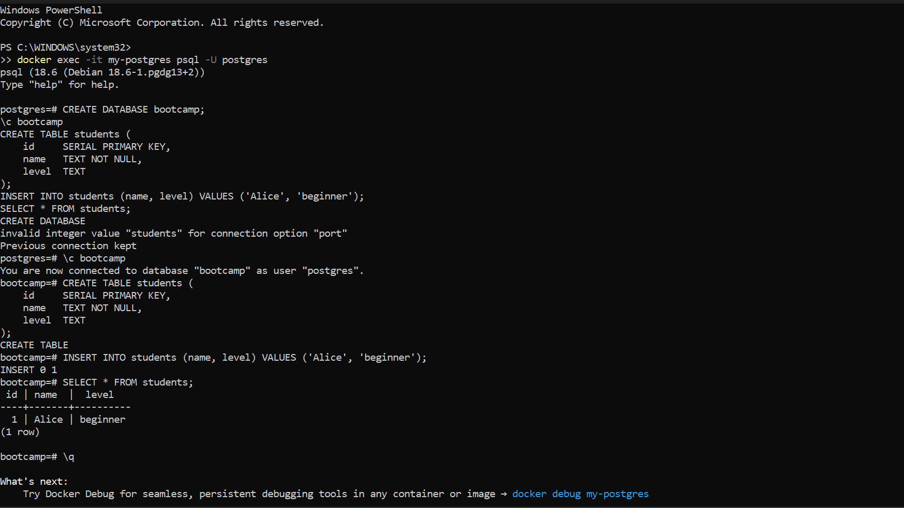
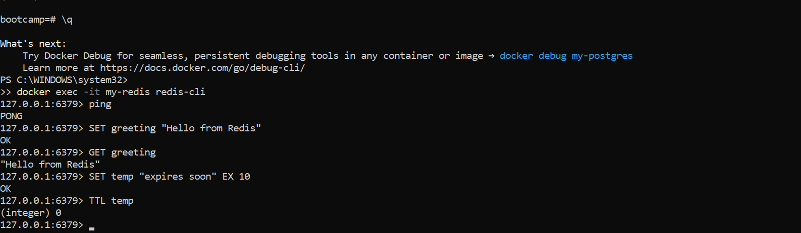
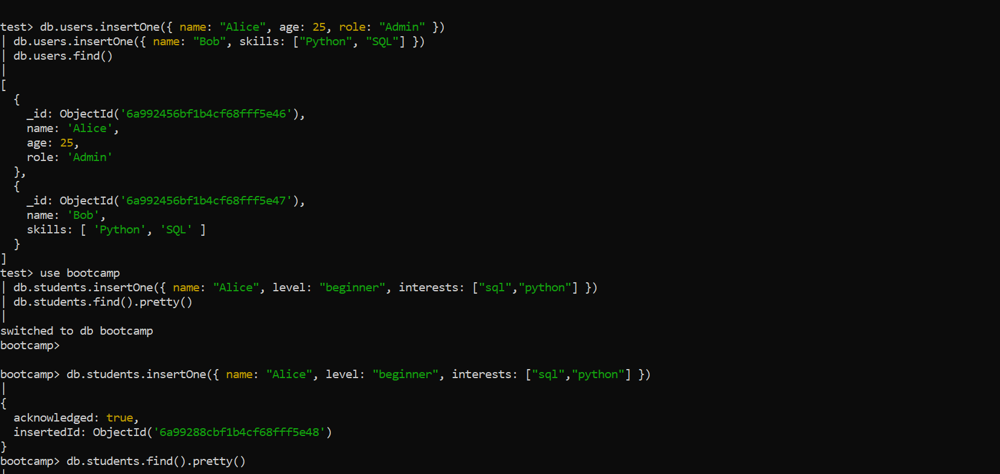

# Hands-On Lab: Setting Up Your Database Workbench

## Step 2: PostgreSQL Relational Database Output
```sql
bootcamp=# SELECT * FROM students;
 id | name  |  level   
----+-------+----------
  1 | Alice | beginner
(1 row)
```


---

## Step 3: Redis Key-Value Database Output
```text
127.0.0.1:6379> ping
PONG
127.0.0.1:6379> SET greeting "Hello from Redis"
OK
127.0.0.1:6379> GET greeting
"Hello from Redis"
127.0.0.1:6379> SET temp "expires soon" EX 10
OK
127.0.0.1:6379> TTL temp
(integer) 8
```


---

## Step 4: MongoDB Document Database Output
```javascript
bootcamp> db.students.find().pretty()
[
  {
    _id: ObjectId('6a99288cbf1b4cf68ff5e48'),
    name: 'Alice',
    level: 'beginner',
    interests: [ 'sql', 'python' ]
  }
]
```


---

## Step 5: Written Reflection Report
MongoDB felt the easiest for storing the student record because it accepts natural, JSON-like documents without needing to pre-configure table fields or data formats ahead of time. In contrast, PostgreSQL required defining a strict relational layout upfront using explicit parameters like `SERIAL` and `TEXT` keys before any entry could occur. Both MongoDB and Redis functioned as schema-less environments where data inserts could happen instantly without a predefined blueprint, offering a highly adaptable approach to saving changing parameters or dynamic datasets.
# Hands-On-Lab-Setting-Up-Your-Database-Workbench
